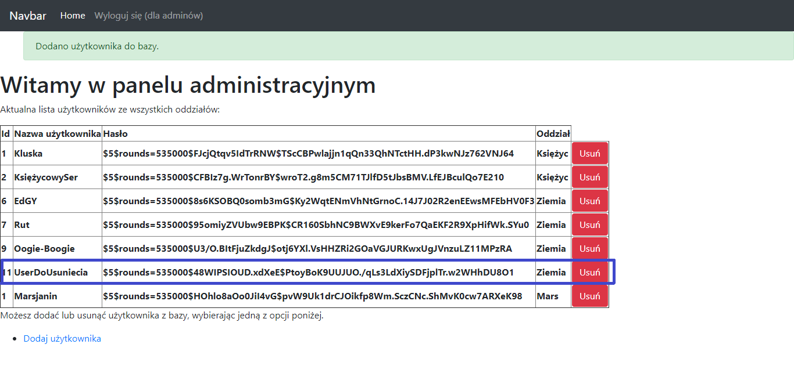

# Skrzat Company

## What's new?

There is no new features.

## About project
Skrzat Company is a project where we have a site with users verification and magement by admin who can add or delete users to the specific organizations (like Earth(Ziemia) ogranization or Moon(Księżyc) organization). The whole project is written in Python with Flask microframerowk and basic SQL queries with database in XAMPP's server package. Content of SkrzatCompany is written in Polish language.

After installing XAMPP and adding project to a valid directory, you can launch it by typing in your browser http://localhost:[port number]/index.html. You should see main page.

You can verify user by choosing an organization, like "Ziemia":

If you don't have a user to check, go to your admin panel:

Then click "Dodaj użytkownika" (Add user) below the list of users. Try to remember password you are typing because it is hashed and you will not restore it from database. 

If you would like to delete user from database, click "Usuń" (Delete) red button near password field.

As you can see, everyting works propely.

## Technologies used in the project
Project was made with:
* Python 3.7
* Flask
* Bootstrap 4.3.1 (to improve appearance)

## Goals

Main goal is to learn about Flask microframework and XAMPP management.

## License

My project is under BSD-2-Clause license. You can use some parts from my code but remember to credit me as an appreciation to my work! Thanks! Awoo!

© 2022 Paweł "Wilczeq/Vlk" Turoń
